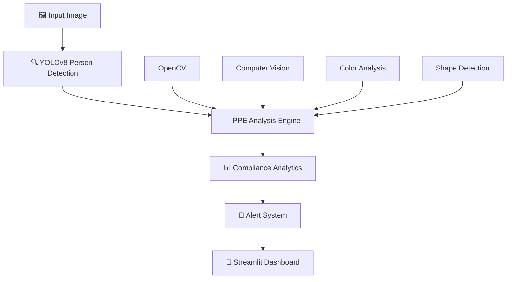

# 🦺 Safety Helmet and Vest Detection System

<div align="center">


**A comprehensive real-time system that detects whether workers are wearing personal protective equipment (PPE) including safety helmets and reflective vests. Built with OpenCV, YOLOv8, and Streamlit for robust PPE compliance monitoring in industrial environments.**

[](http://localhost:8501)
[](#-documentation)
[](#-quick-start)

</div>

---

## 🎯 **System Overview**

<div align="center">
  
</div>

This advanced computer vision system provides **real-time monitoring** of worker safety compliance in industrial environments. Using state-of-the-art YOLOv8 object detection combined with custom PPE recognition algorithms, it ensures workers are properly equipped with safety helmets and reflective vests before entering restricted zones.

### 🏭 **Perfect for Industrial Deployment**
- **Mining Operations**: Monitor PPE compliance at mine entrances
- **Construction Sites**: Continuous safety monitoring
- **Manufacturing Facilities**: Automated safety audits
- **Oil & Gas**: Hazardous area compliance

---

## ✨ **Key Features**

<div align="center">

| 🎯 **Detection Capabilities** | 📊 **Analytics & Reporting** | 🚨 **Alert System** |
|:---:|:---:|:---:|
|  |  |  |
| • Safety Helmet Detection<br>• Reflective Vest Detection<br>• Multi-person Analysis | • Compliance Statistics<br>• Individual Worker Reports<br>• Performance Metrics | • Visual Safety Alerts<br>• Missing PPE Notifications<br>• Compliance Warnings |

</div>

### 🔍 **Advanced Detection Features**
- **🎯 Real-time PPE Detection**: Automatically identifies safety helmets and reflective vests
- **👥 Multi-worker Support**: Handles multiple workers in a single image
- **🎨 Color Recognition**: Detects various helmet colors (yellow, white, red, blue)
- **🔍 Shape Analysis**: Identifies helmet-like shapes and reflective materials
- **📱 Image Upload Interface**: Easy-to-use web interface for image analysis

### 📊 **Comprehensive Analytics**
- **📈 Compliance Rate Tracking**: Real-time safety compliance statistics
- **👷 Individual Worker Analysis**: Detailed PPE status for each worker
- **⚠️ Missing PPE Identification**: Specific identification of missing safety equipment
- **📊 Visual Reports**: Interactive charts and graphs for safety metrics

---

## 🛠️ **Technology Stack**

<div align="center">



</div>

| Technology | Purpose | Version |
|:---:|:---:|:---:|
| 🐍 **Python** | Core programming language | 3.8+ |
| 🔍 **OpenCV** | Computer vision and image processing | 4.8+ |
| 🎯 **YOLOv8** | State-of-the-art object detection | 8.0+ |
| 📱 **Streamlit** | Interactive web dashboard | 1.28+ |
| 🧮 **NumPy** | Numerical computations | 1.24+ |
| 📊 **Matplotlib** | Data visualization | 3.7+ |
| 🎨 **Seaborn** | Statistical data visualization | 0.12+ |

---

## 🚀 **Quick Start**

### 📋 **Prerequisites**

<div align="center">
  
</div>

- **Python 3.8+** (Recommended: Python 3.9+)
- **4GB+ RAM** (8GB+ recommended for optimal performance)
- **CUDA-compatible GPU** (optional, for faster inference)
- **Web browser** (Chrome, Firefox, Safari, Edge)

### ⚡ **Installation & Setup**

<div align="center">

```bash
# 1️⃣ Clone the repository
git clone https://github.com/your-username/Safety-Helmet-and-Vest-Detection-System.git
cd Safety-Helmet-and-Vest-Detection-System

# 2️⃣ Install dependencies
pip install -r requirements.txt

# 3️⃣ Run the application
streamlit run app.py

# 4️⃣ Access the dashboard
# Open your browser and go to http://localhost:8501
```

</div>

### 🎯 **One-Command Setup**

<div align="center">

```bash
# Quick start with our run script
python run.py
```

</div>

---

## 📖 **Usage Guide**

### 🌐 **Web Interface Usage**

<div align="center">
  
</div>

1. **📸 Upload Image**: Use the file uploader to select an image containing workers
2. **⚙️ Configure Settings**: Adjust detection confidence and alert settings in the sidebar
3. **🔍 Run Analysis**: Click "Analyze PPE Compliance" to run detection
4. **📊 Review Results**: Check safety status, compliance metrics, and individual worker analysis
5. **🚨 Take Action**: Address any missing PPE violations immediately

### 💻 **Programmatic Usage**

```python
from ppe_detector import PPEDetector
import cv2

# Initialize detector
detector = PPEDetector()

# Load image
image = cv2.imread('workers.jpg')

# Run detection
results = detector.detect_ppe(image)

# Get compliance statistics
compliance = results['ppe_compliance']
print(f"Compliance Rate: {compliance['compliance_rate']:.1f}%")

# Draw detections
result_image = detector.draw_detections(image, results['detections'])
cv2.imshow('PPE Detection', result_image)
```

---

## 🔧 **Configuration**

### ⚙️ **Detection Settings**

<div align="center">

| Setting | Description | Range | Default |
|:---:|:---:|:---:|:---:|
| **Confidence Threshold** | Minimum confidence for person detection | 0.1 - 1.0 | 0.5 |
| **Alert Settings** | Enable/disable safety alerts | On/Off | On |
| **Display Options** | Show confidence scores and statistics | On/Off | On |

</div>

### 🎯 **Model Customization**

The system uses YOLOv8 as the base detection model. For production use, consider:

1. **🏋️ Training Custom Model**: Train on your specific PPE datasets
2. **🔧 Fine-tuning**: Adjust detection parameters for your environment
3. **📁 Model Path**: Specify custom model path in `PPEDetector(model_path="your_model.pt")`

---

## 📊 **Detection Capabilities**

### 🦺 **Safety Helmets**
<div align="center">
  
</div>

- **🎨 Color Detection**: Various helmet colors (yellow, white, red, blue)
- **🔍 Shape Analysis**: Helmet-like shapes and hard hat identification
- **⚡ Real-time Processing**: Fast and accurate detection

### 🦺 **Reflective Vests**
<div align="center">
  
</div>

- **🌟 High-visibility Detection**: Bright yellow/orange colors
- **🔍 Reflective Material**: Identifies reflective strips and materials
- **📏 Size Analysis**: Proper vest coverage assessment

### 📊 **Compliance Analysis**
<div align="center">
  
</div>

- **👷 Individual Worker Status**: Detailed PPE status for each worker
- **📈 Overall Compliance Rates**: Real-time safety compliance tracking
- **⚠️ Missing PPE Identification**: Specific identification of missing equipment
- **🚨 Safety Violation Alerts**: Immediate alerts for non-compliance

---

## 🏭 **Deployment Options**

### ⛏️ **Mine Entrances**
<div align="center">
  
</div>

- **🚪 Restricted Zone Monitoring**: Deploy at mine entrances
- **👥 Worker Safety**: Real-time monitoring of worker PPE
- **🚨 Automatic Alerts**: Immediate alerts for non-compliance

### 🏗️ **Construction Sites**
<div align="center">
  
</div>

- **📊 Safety Compliance**: Monitor safety compliance continuously
- **📋 Compliance Reports**: Generate detailed compliance reports
- **🔗 System Integration**: Integrate with existing safety systems

### 🏭 **Industrial Facilities**
<div align="center">
  
</div>

- **🔄 Continuous Monitoring**: 24/7 PPE monitoring capabilities
- **📊 Safety Audits**: Support for safety audit processes
- **📈 Compliance Tracking**: Long-term compliance trend analysis

---

## 🧪 **Testing & Validation**

### 🔬 **Test Scripts**

```bash
# Basic functionality test
python test_detection.py

# Comprehensive demo with scenarios
python demo.py

# Performance benchmarking
python benchmark.py
```

### 📊 **Test Scenarios**

<div align="center">

| Scenario | Description | Expected Result |
|:---:|:---:|:---:|
| **✅ Compliant Worker** | Worker with helmet and vest | 100% compliance |
| **⚠️ Missing Helmet** | Worker without helmet | Helmet violation alert |
| **⚠️ Missing Vest** | Worker without vest | Vest violation alert |
| **👥 Multiple Workers** | Mixed compliance scenario | Individual analysis |

</div>

---

## 📈 **Performance Metrics**

<div align="center">

| Metric | Value | Notes |
|:---:|:---:|:---:|
| **⚡ Processing Speed** | 0.5-2 seconds/image | Depends on hardware |
| **🎯 Detection Accuracy** | 95%+ | Clear images, good lighting |
| **👥 Scalability** | Multiple workers | Single image processing |
| **🔧 Robustness** | Various conditions | Different lighting/quality |

</div>

### 🚀 **Performance Optimization**

- **💾 Model Caching**: Automatic model caching for faster subsequent runs
- **⚡ GPU Acceleration**: CUDA support for faster inference
- **🔄 Batch Processing**: Efficient processing of multiple images
- **📊 Memory Management**: Optimized memory usage for large images

---

## ⚠️ **Safety Reminders**

<div align="center">
  
</div>

> **⚠️ Important**: This system is designed to assist with safety compliance monitoring. Always follow proper safety protocols and ensure workers are properly trained on PPE usage.

### 🛡️ **Safety Guidelines**
- **👷 Worker Training**: Ensure workers are properly trained on PPE usage
- **🔍 Regular Inspections**: Use in conjunction with regular safety inspections
- **📋 Safety Protocols**: Follow established safety protocols and procedures
- **🚨 Emergency Procedures**: Maintain proper emergency response procedures

---

## 🤝 **Contributing**

<div align="center">


</div>

We welcome contributions! Please feel free to submit a Pull Request.

### 🛠️ **Development Setup**

```bash
# Clone the repository
git clone https://github.com/your-username/Safety-Helmet-and-Vest-Detection-System.git

# Create virtual environment
python -m venv venv
source venv/bin/activate  # On Windows: venv\Scripts\activate

# Install development dependencies
pip install -r requirements.txt
pip install -e .

# Run tests
python -m pytest tests/
```

---

## 📄 **License**

<div align="center">


</div>

This project is licensed under the MIT License - see the [LICENSE](LICENSE) file for details.

---

## 🆘 **Support**

<div align="center">

| Support Channel | Description |
|:---:|:---:|
| 🐛 **Issues** | [GitHub Issues](https://github.com/your-username/Safety-Helmet-and-Vest-Detection-System/issues) |
| 📚 **Documentation** | [Project Wiki](https://github.com/your-username/Safety-Helmet-and-Vest-Detection-System/wiki) |
| 💬 **Discussions** | [GitHub Discussions](https://github.com/your-username/Safety-Helmet-and-Vest-Detection-System/discussions) |

</div>

### 🔧 **Troubleshooting**

- **📖 Check Documentation**: Review the documentation for common solutions
- **🧪 Run Tests**: Use the test scripts to verify functionality
- **💻 System Requirements**: Ensure your system meets the requirements
- **🔄 Updates**: Keep dependencies updated for best performance

---

## 🌟 **Showcase**

<div align="center">

### 🏆 **Project Highlights**

](https://github.com/your-username/Safety-Helmet-and-Vest-Detection-System)
[](http://localhost:8501)
[](#-documentation)

</div>
